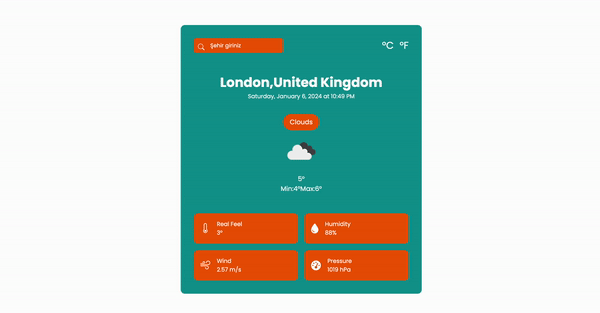

<h1>WeatherApp</h1>

# Hava Durumu Bilgi API Projesi

Bu proje, hava durumu verilerini bir API üzerinden çekmek amacıyla geliştirilmiştir. Proje, belirli bir tarih ve saat için farklı şehirler ve ülkelerin hava durumu bilgilerini sağlamaktadır.

## Kullanılan Teknolojiler

- **Programlama Dili:** javascript
- **API Kütüphanesi:** Openweather

<h3>Ekran Görüntüsü</h3>

   

#Api::https://openweathermap.org/current

